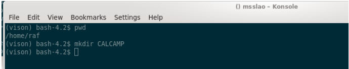
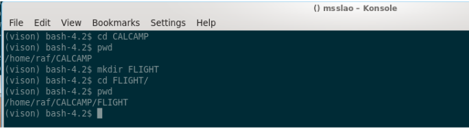
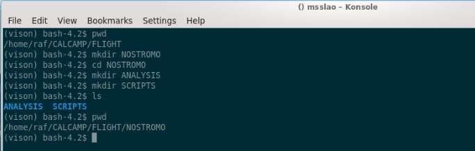
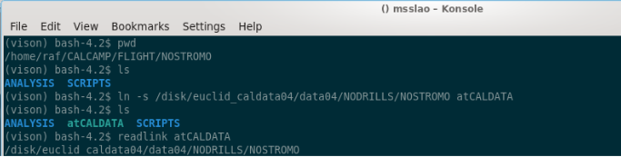
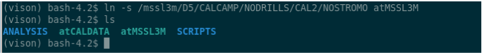
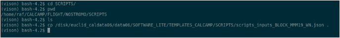
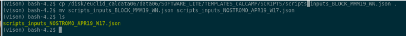
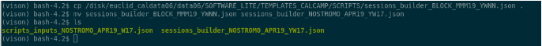
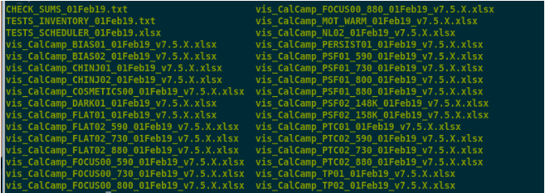

.. _cookbook:

***************
vison cook-book
***************

This cook-book is an adaptation of a guide used during the actual calibration campaign. As such, it contains mentions to specific machines in MSSL, which are not really important to the workings of the code, but we have decided to leave the document as close to the original as possible, for it illustrate how the code was used in practice.

This guide was written for users with little acquaintance with Linux. That's why there are so many comments about linux commands and their use throughout the text.

Accessing “vison”, the pipeline
===============================

The pipeline and all accessory software is installed at:

**/disk/euclid_caldata06/data06/SOFTWARE_LITE/**

To use it, we have to do a few steps that will be detailed below, but in a nutshell these are:

* ssh-connect to a Linux machine in the MSSL network from where we can access both the software and the data, which will be in any of the euclid_caldata0X drives. 
* Change the shell to “bash” and change the system paths to the right values necessary to find the conda environment within which the pipeline is installed.
* Activate the “conda” environment in which the pipeline runs. This environment has all the libraries that the pipeline needs to run.

Then you should be ready to use the pipeline, which can be imported as a Python package, or most likely, you will use via one of its several command line scripts. 

Now we explain and show these steps in more detail.

Connecting to the remote machine via ssh
----------------------------------------

The machines in which we’ll run the pipeline to do data “checks” and “analysis” are:

* MSSLAP
* MSSLAN
* MSSLAO

To ssh any of them do, from a terminal:

 ::

    >> ssh -Y mssla?    # ? is here just a wildcard, one of (p,n,o)
    Mullard Space Science Laboratory (Distribution 11.0)

 This computer system is the property of University College London.

 Use of this system is limited to authorised individuals only. You are
 committing a criminal offence under the Computer Misuse Act 1990 sect 1,
 if you attempt to gain any unauthorised access either to this system or any
 others at this site.

 Communications on or through University College London's computer systems
 may be monitored or recorded to secure effective system operation and for
 other lawful purposes.

::

 user@mssla?'s password:   # enter here you password

The “-Y” in the command allows to have graphical output from the program redirected to your computer screen.

Changing shell to bash and updating system paths
------------------------------------------------

**IMPORTANT**: once we’re connected to the remote machine, mssla?, we change the command shell to “bash”:

 ::

     [user@mssla? ~]$ bash   # hit Enter
     bash-4.2$ 

Then we have to source a “bashrc” file so that we have the right system “PATHS” to find the pipeline.

 ::

     bash-4.2$ source /disk/euclid_caldata06/data06/SOFTWARE_LITE/bashrc_lite # hit Enter
     bash-4.2$

Activating the “vison” conda environment
----------------------------------------

Now we can activate the “vison” conda environment within which the pipeline is installed. If you want to know what “conda” is, check this out https://www.anaconda.com/. 

All you have to do to activate the environment is this:

 ::

     bash-4.2$ source activate vison # hit Enter
     (vison) bash-4.2$ 

Now we see (vison) preceeding the bash prompt. This indicates we’re within the “vison” conda environment, and the pipeline should already be accessible. To check this is the case, do this and check you get the same reply:

 ::

    (vison) bash-4.2$ which vison_run # hit Enter
    /disk/euclid_caldata06/data06/SOFTWARE_LITE/anaconda2/envs/vison/bin/vison_run

This indicates both that the command “vison_run” which executes the pipeline is accessible, and that we’re using the pipeline installed in euclid_caldata06/data06/SOFTWARE_LITE, as we should.

Data Checks / Analysis Work Environment Setup
=============================================

Before we can start using the pipeline, it is most convenient, and strongly suggested, to set up a consistent work environment, creating a number of folders and symbolic links in a workspace directory, so we can produce results that are useful, traceable, and easy to recognize by other members of the team (for inspection, or collaborative work). This is a guide to set up such a workflow. We’ll go step-by-step.

1. Starting point: assumptions
------------------------------

We’ll assume that we are already ssh-connected to one of mssla? and activated the “vison” conda environment, following the indications of the first part of this tutorial: Accessing “vison”, the pipeline.

2. Creating a working CALCAMP directory tree in our $HOME folder.
-----------------------------------------------------------------

We’ll first create a work folder in your $home folder, where we’ll do all the check/analysis tasks related to the CALCAMP.

We move into CALCAMP and create a FLIGHT subfolder:

Note: the “pwd” command shows where we are, the current directory.

Now, for the sake of exercise, we’ll assume we’re going to calibrate a block dubbed “NOSTROMO”. **We’ll create the following folder structure below “FLIGHT”**:

Note: the “ls” command lists the contents of the folder we’re in, and “pwd” shows where we are.

Now we will create symbolic links to the folders where the data are, so the paths we give to the pipeline are conveniently short. So, while at the NOSTROMO folder, we first create a link to the path in euclid_caldata0X where the data are:

**Note**: of course, it is an assumption for the exercise that the data for the fictitious block NOSTROMO is in euclid_caldata04/data04… in practice you’ll have to ask test_scheduler where the data is to be copied in euclid_caldata0X for the block of concern.

Now, if we’re also writing scripts for the test_operators, and/or doing data acquisition monitoring using eyegore, it’ll also be convenient to create a symbolic link to the folder in MSSL3M/EEDisk5 for this block. That’s where the data is being copied by the laptop running ELVIS in ISO8 [lab room]. 

**NOTE: In order to have permanently mounted access points to the EEDisk5 drive of MSSL3M you’ll have to ask help from IT… and you’re not guaranteed to get it, they’re very reluctant about this. So, it’s likely that only if you connect to MSSLLX, where those access points have already been created (and are at least accessible for user raf), instead of MSSLA[O/N/P], that you’ll be able to link to / access that drive in the convenient way we describe in this tutorial.**

For the time being we’ll assume you also have EEDisk5 permanently mounted for you in 
/mssl3m/D5/, as it’s done in MSSLLX (for user raf, at least).

So, we create a symbolic link to the NOSTROMO folder in MSSL3M/EEDisk5 at your NOSTROMO folder in CALCAMP.

So far we haven’t really done anything but creating directories and some symbolic links. Now let’s move to start copying some template input files and python scripts we’ll need to actually do something. 

3. Copying the script-writer session-builder scripts from the templates folder
------------------------------------------------------------------------------

The template scripts that are used by the pipeline to run, are all saved in:
/disk/euclid_caldata06/data06/SOFTWARE_LITE/TEMPLATES_CALCAMP

To do a local copy of the scripts-writer inputs file we’ll do the following:

Now we rename the file to a name that’s meaningful for the calibration campaign of NOSTROMO, in particular:

Where we have assumed that this BLOCK will be calibrated in April ‘19, on week 17 in the year, in particular.

Then you’ll have to go to the specific tutorial on writing scripts for the campaign to follow on that.

Once you’ve written the scripts you’ll also want to create a number of “sessions”, with a specific set of tests in a specific order within them. This is most safely done using another pipeline script, vis_mksession.py. In order to run this script you’ll also need an inputs file, which we’ll copy from the templates folder:

4. Copying the check/analysis script from the templates folder
--------------------------------------------------------------

To copy the template analysis script to the local working folder, and renaming it with a meaningful name we’ll do:

It is **very important** to rename the copied file to something that actually has meaning, so that when this file is moved to the results folder, for reference, it’s easy to find, and we know what it is. The analysis script holds most of the relevant information about the configuration of the pipeline when the analysis was performed, which is useful for tracing back what has been done. The rest of the information about what the pipeline did will be stored in the outputs of the analysis itself.

To learn about how to edit this script and actually use the pipeline to check / analyze data, follow to the corresponding tutorial.

Workflow Description
====================

In this section we describe the work-flow of operations for those doing the following tasks during the calibration campaign:

* Writing acquisition scripts (using vis_mkscripts.py and vis_mksession.py).
* Doing the data-acquisition monitoring in real-time (using eyegore).
* Doing the analysis (using vison_run).

These activities should be assigned to different roles/persons, and formally the are. But because in practice, they are usually done by the same person, and regardless of this, they are so closely related, we’ll present them together and interleaved, as they are in practice.

WRITING SCRIPTS / SESSIONS
--------------------------

Step-by-step description of what to do regarding the writing of test scripts and building sessions.

.. csv-table:: 
    :header: "Step", "Action", "Comment"
    :widths: 3, 20, 40

    1, "Get hardware serials from Campaign director.", "We need these to write the scripts, so that ELVIS writes the meta-data of the images and EXP-LOG correctly."
    2, "Using the CHAMBER profile that corresponds to the chamber, write scripts.","Here we’re using the best focus from the last time we measured it in this chamber. So, it may be slightly off. Still, we only run tests without point-source in the first sessions, D00, D11 and D12 (except the FOCUS00 test that measures the focus), and so this is not a problem."
    3, "We create the sessions D00, D11, D12", "Using the written scripts, and the schedule provided by Cal. Camp. Scheduler, we’ll build the sessions D00, D11, D12 using vis_mksession.py. These sessions do not include point-source tests, except the FOCUS00, in some cases, the PSFLUX00 test, for which the focus setting is not critical, and the PERSIST00 test in which we deliberately de-focus the source by a large margin."
    4, "Inspect at least some of the scripts", "At least verify the serials of the hardware are correct in the scripts."
    5, "We copy the sessions to MSSL3M/D5", "We copy the scripts and sequence files from these sessions to the corresponding block folder in MSSL3M/D5, and let the test operators know via email (with test camp. Director on copy)."
    6, "Update focus in pipeline based on results from PSF01_NNN (_800)", "As soon as the results from the focus test in session D11 are out, we can update the focus position for this chamber. It’s the pipeline custodian who does it, but we can give him the new best estimate given the results from test PSF01_NNN."
    7, "Update exposure times, if needed", "If the results from the campaign so far require it (say from any test FLATFLUX00 or PSFLUX00), also update the exposure times at this point. We do not expect this to be necessary once the chamber has been commissioned." 
    8, "Write scripts for sessions D21 and D22", "We write the scripts again, with the new focus position update."
    9, "Make sessions D21 and D22", "Using vis_mksession.py we create sessions D21 and D22 using the latest scripts."
    10, "Check new scripts", "Check serials are right in at least one of the new scripts, and verify the changes in focus (and exposure time, if there have been), have been effective in the tests where this applies."
    11, "Copy session D12 and D22 to MSSL3M/D5", "We copy the sessions D21 and D22 to MSSL3M/5 and let the test operators know via email with test director on copy."

Details on how to write scripts and sessions, using the pipeline scripts **vis_mkscripts.py** and **vis_mksession.py**, are provided elsewhere.

Real Time Data Inspections using Eyegore
----------------------------------------

As soon as we start acquiring, we should be running “**eyegore**” on the data that should be “flowing” to MSSL3M from the laptop running ELVIS in ISO8.

**WARNING**: Currently, many of the eyegore capabilities quoted below can only be performed by **user “raf”** from “his” machine MSSLLX. The reason for this are mostly down to limitations of permissions granted to users for (convenient) access to servers (to MSSL3M and MSSLUS) or files (with passwords needed to send warning sms, for example).

These are the main capabilities of eyegore, that justify its use in parallel with the acquisition at all times:

* Eyegore gives a **synoptic view** of the HK that can allow for quick identification of major issues with the hardware (voltages / currents / temperatures out-of-limits). This of course requires visual attention to the eyegore windows from time to time (**at least once every hour**), while in office hours.
* We can track progress with the **EXP-LOG display** of the data acquisition. We can also use it to send images to DS9 with a mouse double-click, for quick inspection of incoming data.
* We can activate the **warning system** of eyegore so we’re warned of major HK OOL conditions (e.g. detectors being dangerously cold) via email and sms (though this latter function can only be used by user raf, by now).
* Eyegore can also be used for **automatic and on-the-fly back-up of the data to the euclid_caldata** drive of choice for this block. And this is not only a safety/precaution measure, we also need the data to be in a euclid_caldata folder in order to run the pipeline for checks/analysis from any of the designated linux machines in the network for this tasks.
* Eyegore can also be used to rely the data to the “**msslus**” server as we acquire it, so that external data inspectors can have access to it asap. These “external eyes” have proved to be very useful in identifying issues with the hardware in the past, and so it’s deemed very important for the calibration campaign that we keep serving them the data through msslus as we acquire it.

Details on how to do the data acquisition monitoring using **eyegore** are provided elsewhere.

Checking Data Quality / Analysis
--------------------------------

The data-checks and data-analysis are related tasks, but they are not the same thing. Let’s clarify the differences, before proceeding to explain how and when to do both.

The pipeline has assigned to each test we perform in the calibration campaign a “Task”. These Tasks are Python objects with some methods that effect some processing (not in-place), measurements, and in general analysis, on the data of a test (or type of tests). The, these “Tasks” are subdivided in “sub-tasks”, and the pipeline, executes these sub-tasks in sequence when we call that Task to be run on a data-set. Then, the “data checks” are just a part of the sub-tasks that compose the Tasks. This is effected by a sub-task which invariably is named “check_data” in the Task classes, and is activated by setting check=True in the todo_flags dictionary of the Task. For doing the “data checks” we need to at least have been done before all the previous sub-tasks in the Task (Task initialisation, and in some cases also point-source locking / targets finding). The “data checks” are a very limited set of measurements performed on the raw data that allow to judge whether the data acquired is complete and of sufficient quality to perform the analysis which the data is intended for. 

Without further ado, let’s proceed to enumerate the steps we have to follow to do the data-checking and analysis during the calibration campaign, in parallell with the data acquisition.

.. csv-table:: 
    :header: "Action", "Comment"
    :widths: 30, 40

    "folder trees and links to data folders", "Create the folder structure, with symbolic links as needed, described in section 2."
    "Rename and Fill the vison configuration script", "Copy the vison configuration python script, rename it with the right block name and date, and edit it according to the expected distribution of tests in sessions, hardware serials, chamber ID, block ID, etc."
    "Check todo_flags", "Check values of the todo_flags dictionaries in the vison configuration Python script."
    "Session **D00**: Run Pipeline on **MOT_WARM** test in **wait mode**", "Run pipeline on test MOT_WARM (as soon as test is finished) to check data and give the go-ahead signal to pump down or not, according to results."
    "Session **D11**: run in **wait mode**.","Run pipeline in wait-mode along with acquisition of D11 session. Use results from FOCUS00, and FLATFLUX00/PSFLUX00 to update focus and/or saturation times in pipeline, as needed."
    "Fill up Test Record with results from session D11", "Done by data analysts, using the results from the pipeline on session D11."
    "Alert pipeline custodian of need to change to pipeline / ogse configuration","Ask pipeline custodian to update ogse values (focus, fluxes), so that the script writers can write updated scripts for next sessions (in particular point-source tests)."
    "Update day-folders and Obsid limits in config file", "Update day-folder value for session D11 and OBSID limits for each test within the session in the vison configuration script."
    "**Session D11: run in aim mode**", "After session D11 is finished, run the pipeline again on the session to complete analysis while the data from session D12 is being acquired. Some test results are more urgent than others, and this must be taken into account. Prioritize as needed."
    "**Session D12: run in wait mode**", "For all tests in this session the pipeline will be asked to at least do the data-checks, and for some other tests we’ll also ask full-analysis, so that those results can be put in the test report (excel) asap. These choices are efected by changes to the todo_flags in the vison Python configuration script."
    "Update day-folders and Obsid limits in config file", "Update day-folder value for session D12 and OBSID limits for each test within the session in the vison configuration script."
    "**Session D12: run in aim mode**", "After session D12 is finished, run the pipeline again on the session to complete analysis while the data from session D21 is being acquired. Some test results are more urgent than others, and this must be taken into account. Prioritize as needed."
    "**Session D21: run in wait mode**", "While data from session D21 is being acquired, run pipeline in wait mode, in parallel, to produce check-data results."
    "Update day-folders and Obsid limits in config file", "Update day-folder value for session D21 and OBSID limits for each test within the session in the vison configuration script."
    "Session D21: aim mode.", "After session D21 is finished, run the pipeline again on the session to complete analysis while the data from session D22 is being acquired. Some test results are more urgent than others, and this must be taken into account. Prioritize as needed."
    "Session D22: run in wait mode", "While data from session D21 is being acquired, run pipeline in wait mode, in parallel, to produce check-data results."
    "Update day-folders and Obsid limits in config file", "Update day-folder value for session D22 and OBSID limits for each test within the session in the vison configuration script."
    "Session D22: run in aim mode.","After session D22 is finished, run the pipeline again on the session to complete analysis. Some test results are more urgent than others, and this must be taken into account. Prioritize as needed."

**IMPORTANT**: If there are test failures, or we just decide to change the order of some tests after the run has started (hopefully not a common situation) we’ll need to reschedule tests, and this may require modifications to the vison configuration script so that the pipeline knows in which session are the tests, and where is the data.

Detailed instructions on how to run the pipeline using vison_run are provided elsewhere.

How to Write Test Scripts and Create Sessions
---------------------------------------------

Writing Test Scripts
^^^^^^^^^^^^^^^^^^^^

To write scripts we use a pipeline script, vis_mkscripts.py. This is called like this from a terminal:

::

    bash$ vis_mkscripts.py -j scripts_inputs_BLOCK_MMM19_WN.json

The .json file has information about the hardware serials, ELVIS version to be used, Chamber and tests to be written. Here is an example of input json file to write scripts with the pipeline, with comments. The comments, even if they are behind “#” signs make the pipeline fail:

::

      {
        "equipment": {
            "sn_roe": "FMNN", # substitute NN with the right serial.
            "sn_rpsu": "FMNN", # substitute NN with the right serial.
            "operator": "unk", # do not modify, it's just not possible to know who will execute the script in advance.
            "sn_ccd1": "14XXX-XX-XX", # substitute NN with the right serial.
            "sn_ccd2": "14XXX-XX-XX", # substitute NN with the right serial.
            "sn_ccd3": "14XXX-XX-XX"  # substitute NN with the right serial
        },
        "elvis": "7.5.X", # elvis version
        "CHAMBER": "CHAMBER_ID", # This is used by the pipeline to compute the right exposure times, for example.
        "camptype": "Full",      # Type of campaign. Always "Full" for FM Calibration campaign.
        "outpath": "Scripts_BLOCK_MMM19_WN", # output path, example: Scripts_BORN_MAR19_W1 
        "toWrite": {   # 1 means write the script(s) and 0 do not write. 
                    Some test labels produce more than 1 script. For example, if there are
                    several wavelengths.
            "BIAS01": 1, 
            "BIAS02": 1,
            "DARK01": 1,
            "CHINJ01": 1,
            "CHINJ02": 1,
            "TP01": 1,
            "TP02": 1,
            "FLATFLUX00": 0,
            "FLAT01": 1,
            "FLAT02": 1,
            "PTC01": 1,
            "PTC02WAVE": 1,
            "PTC02TEMP": 0,
            "PTC02RD": 0,
            "NL01": 0,
            "NL02": 1,
            "NL02RD": 0,
            "PSFLUX00": 0,
            "PSF01": 1,
            "PSF02": 0,
            "FOCUS00": 1,
            "PERSIST01": 1,
            "MOT_WARM": 1,
            "COSMETICS00": 1
        }
    }

Here’s an example of the contents of the folder where the pipeline outputs all the scripts:

Contents of the folder where the scripts are written.

One-by-one, these files are:

* **CHECK_SUMS_01Feb19.txt**: this is a plain-text file with the name of the scripts and their checksums. I usually reuse this file, the listing of script names, to build the “sequence” files used by ELVIS to execute the tests in sequence. I just copy the names from this file to the sequence files, manually.
* **TESTS_INVENTORY_01Feb19.txt**: plain-text file with a summary of the tests. Contents:
    * Header:
        * Date and time when scripts have been written.
        * Name of the corresponding CHECK_SUMS file.
        * Pipeline version.
    * For each test:
        * Test Name: Nr. of columns, expected duration, frames in each column.
    * Total Nr. of Frames.
    * Total duration in minutes.
* **TESTS_SCHEDULER_01Feb19.xlsx**: An excel with all the tests, their number of columns, frames and durations. These test entries (rows in the excel) can be easily copied across to the “scheduler” spreadsheet for the Cal. Camp. of each block.
* The test scripts: **vis_CalCamp_TESTNAME_DDMmmYY_v7.X.X.xlsx**.

Making Sessions
^^^^^^^^^^^^^^^

As we have seen, the pipeline writes all scripts to the same folder. And there is no “sequence” file that can be used by ELVIS to ingest tests. Thus, dividing the tests in session folders, each with a sequence file (a list of script file names, one per line) that can be ingested by ELVIS, would have to be done by hand. But now it is possible to do it in a less prone-to-error fashion using the pipeline, through a script named vis_mksession.py. Here we describe how.

To create a number of sessions from a directory with test scripts, we’d command:

::

    (vison) bash$ vis_mksession.py -j sessions_builder_BLOCK_MMM19_YWNN.json

The .json file has information about where to find the scripts (written with vis_mkscripts.py), where to create the session folders, and the tests that are within each session, and in which order. The tests are identified by their name on the script files, and they will be added to each session in the specified order. If there are more than 1 script for the same test in the inputs folder, the application will halt with a message alerting of the issue. The same would happen if it doesn’t find at least one script for that test. Example of input json file to create the sessions with the pipeline, using vis_mksession.py:

::

    {
        "inpath": "Scripts_BLOCK_MMM19_YWNN",
        "outpath": "SEQUENCES_BLOCK_MMM19_YWNN",
        "sessions": {
            "D00": ["MOT_WARM"],
            "D11": ["COSMETICS00",
                    "FOCUS00_800",
                    "FLATFLUX00_800",
                    "PSFLUX00_800",
                    "PTC02_730"],
            "D12": ["BIAS02",
                    "BIAS01",
                    "CHINJ01",
                    "CHINJ02",
                    "TP01",
                    "TP02",
                    "PTC01",
                    "NL02",
                    "FLAT01",
                    "DARK01",
                    "PTC02_590",
                    "PTC02_880",
                    "PERSIST01"],
            "D21": ["BIAS02",
                    "PSF01_590",
                    "FLAT02_590"],
            "D22": ["BIAS02",
                    "PSF01_730",
                    "FLAT02_730",
                    "PSF01_800",
                    "FLAT02_880",
                    "PSF01_880"]
        }
    }

**WARNING**: We may need to write scripts and make sessions more than once during a run, if there’s an update to the OGSE parameters (focus / fluxes), or there’s a change in the schedule for any reason.

Data Analysis Cookbook
======================

Introduction
------------

In this part we describe how to run the ground calibration pipeline, vison, to analyse test data. The pipeline has multiple functions, which can be accessed either as a Python package, or more usually for the end-user (aka you), via several command scripts. Here we will restrict ourselves to using the pipeline to do:

* Analyse data on-the-fly (as we acquire it), and optionally restricting ourselves to just checking the integrity and quality of the data (i.e. without doing the actual analysis the test is intended for). 
    * **Nota bene**: when we say analysis / check on-the-fly, it isn’t strictly on-the-fly, as the pipeline has to wait for all the data from a given test to be acquired to actually start inspecting / analysing the test. 
    * **Nota bene 2**: there are tools in the pipeline to inspect data / HK as it’s acquired, via the “eyegore” tool, but that’s the subject of another dedicated tutorial.

(In depth) Analysis of the data post-acquisition
-------------------------------------------------

Editing the vison_config_*.py file
^^^^^^^^^^^^^^^^^^^^^^^^^^^^^^^^^^

The most delicate and complicated part of running the pipeline is editing the configuration script, a Python script itself, that’s used to configure the pipeline, to tell it what to do, and with which data.

To execute the pipeline we’ll use the command “**vison_run**”, with a number of options, like for example:

::

    (vison) bash$ vison_run vison_run -y vison_config_BLOCK_MMM19.py -R DNN -l -t _DNN -m 6

In the preceding command, we’ve highlighted the reference to the Python configuration file, **vison_config_BLOCK_MMM19.py** of concern here. Now we will go through a template for this file, and comment on what inputs we must provide in order to run the pipeline with it.

The script is about 400 lines long (the exact total length depends on how many tests are done within the run, as you’ll soon understand), but you only have to modify some of them. 

To copy the template analysis script to the local working folder, we’ll do:

::

    (vison) bash $ cp /disk/euclid_caldata06/data06/SOFTWARE_LITE/TEMPLATES_CALCAMP/ANALYSIS/vison_config_BLOCK_MMM19.py .

It is very important to rename the copied file to something that actually has meaning, so that when this file is moved to the results folder, for reference, it’s easy to find, and we know what it is. So, you’ll replace “BLOCK” with the block-name (e.g. “BORN”), and “MMM19” with the month-year date.

In Fig. 1 we see a commented version of the first part (first ~70 lines) of the configuration script. There you have pointed out where you would put the name of the BLOCK you’re about to analyse (e.g. BORN), and your name, for the record.

Fig. 1: First part of the configuration file (edited first). Here you have to introduce the BLOCKID “nickname”, as corresponding (e.g. “BORN”), and your name, for the record (the configuration file will be saved as part of the record of what has been done). In the commented-out area you have a cheat-sheet with the todo_flags for each test.

Then we’ll skip to the last part of the script, which we show in Fig. 2. Here we will edit a number of entries:

dataroot: where the parent data folder is, relative to where the configuration file is.
datapath: you can leave this with the default values.
cdppath: a folder where you’ll put some calibration data-products needed by the pipeline (namely the cosmetics masks, by now).
resroot : the parent folder where the results from the pipeline will be written. The session folders will hang from this path. Usually this will be a symbolic link named “results” to a folder in euclid_caldata0X/data0X/results (exact location depends on block).
BLOCKID: The block nickname.
CHAMBER: What chamber profile we’re using. Depends on what chamber we’re testing in, obviously. This is a critical parameter, because depending on this we’ll use the right exposure times, or not.
diffvalues: in this Python dictionary we provide the pipeline with information about the hardware under testing. This is, the serials of the ROE, RPSU and CCDs. If the serials do not match those provided at the time of writing the acuisition scripts, the pipeline will report about it, but will still analyse the data.
inCDPs: if you have cosmetics masks computed for the detectors, here’s where you tell the pipeline where to find them.

Then, there’s the dictionary “tasks2execute_dict”, where you tell what “tasks” are to be executed within each session. Each “task” corresponds to a “test”. But, as you’ll see, the task names in this dictionary do not exactly correspond to the test names, but they are shorter and/or slightly different. This is because some of the tests are particular “instances” (using this Python term loosely here) of more general tests which can have different wavelengths or other characteristics. In this dictionary we provide “handles” to those more generic test types. The correspondence between test names and the generic handles is given in the following table.

TEST/TASK NAME
GENERIC TEST HANDLE
MOT_WARM
MOT_WARM
BIAS01
BIAS01
BIAS02
BIAS02
DARK01
DARK01
COSMETICS00
COSMETICS00
FOCUS00_NNN [NNN=wavelength in nm]
FOCUS00
PSFLUX00_NNN [NNN=wavelength in nm]
PSFLUX00
FLATFUX00_NNN [NNN=wavelength in nm]
FLATFLUX00
CHNJ01
CHINJ01
CHINJ02
CHINJ02
TP01
TP1
TP02
TP02
NL02
NL02
PTC01
PTC01
PTC02_NNN [NNN=wavelength in nm]
PTC02WAVE
FLAT01
FLAT01
FLAT02_NNN [NNN=wavelength in nm]
FLAT02
BF01
BF01
BF01_NNN [NNN=wavelength in nm]
BF01WAVE
PSF01_NNN [NNN=wavelength in nm]
PSF01
PERSIST01
PERSIST01
Correspondence between specific test names and generic test handles.

Fig. 2.: Third/last part of the configuration file (edited second). 

Then we proceed to the third part to edit, which is actually in the ~middle of the script, and is shown in Fig. 3. What we have to edit is the first part of the function “add_RUN_specifics” (around line 113 in the script). 

Because of its verbosity, this part of the configuration file is probably where it’s more likely that we’ll make errors that will lead to not getting results, or at least not those we hope for out of the pipeline. So tread with even more care here than in the previous sections.

In this section you “only” have to edit the contents of the dictionary “test_specifics”. In it, there are all the sessions which will compose this run. For each of these sessions (named DNN, like D11), there is a list of lists, each corresponding to a specific test. 

Here, the tests are named by their specific name, not the generic ones. So, for example, including the wavelength, where it applies.

For each test, there’s an entry with the following structure:

[‘TEST_NAME’, [Obsid_start, Obsid_end], dict(init=True,check=True,basic=True)]

Let’s break up these entries:

TEST_NAME is just that, the test name (e.g. BIAS01).
The second item is a list, which contains the first and last obsid for the test data. When we’re running the pipeline in “listening/wait” mode we won’t know this in advance, and this list will have the value: [None, None] (None is a valid variable in Python which has a “null” value).
The third item is a dictionary, called the “todo_flags”. This tells the pipeline which sub-tasks within the task to execute. And as you may expect, “True” means you want the sub-task executed, and “False”, that you don’t. This allows for fine control of what we want to do for each test, and is most convenient as we may just want to do part of the analysis at a given time, or we may not want to repeat all the analysis for a test, but just part of it, when rerunning the pipeline.

 You’ll find templates of how the specific inputs for each test look like at the top of the script (commented lines).

Fig. 3. Second part of the configuration file, to be edited last. 

Executing the pipeline

As we said above, we can run the pipeline in several “modes”. Here we describe briefly what are these modes, and provide a high-level description of the inputs in each case, leaving the details for the recipes section below.

“Wait” mode
In this mode, the pipeline is launched as soon as the data acquisition of a session starts, and the pipeline will process the data of each test as soon as it is completed.
This is the quickest way to obtain check/data-quality assessments of the tests.
Basically we have to give the pipeline (via the configuration file and keyword inputs to the command):
 a location where to find the data (the path to the “data” folder)
A location where to store results.
Where to find calibration data products, if needed.
A BLOCKID and a CHAMBER identifier.
Serials for the hardware,
Names of the input calibration data products (e.g. cosmetics masks), if needed.
A test list.
Optionally, test-specific todo_flags (via the entries in the test_specifics dictionary within add_RUN_specifics function) if we’re not just “checking” on all tests using option -k.
“Aim” Mode
In this mode we tell the pipeline where to find the data, with specific starting and ending obsids, and, in general, we’ll aim at doing more extensive analysis of the data. But the real difference with the previous mode is that the pipeline will not be waiting for the data, but rather assume it’s already there, and it is told exactly where to find it.
This is the mode we’ll use to produce the end-results of the calibration.
We have to give the following inputs in this mode:
a location where to find the data, including the day-folder, via the test_specifics dictionary within add_RUN_specifics function.
A location where to store results (“resroot”).
Where to find calibration data products, if needed.
A BLOCKID and a CHAMBER identifier.
Serials for the hardware,
Names of the input calibration data products (e.g. cosmetics masks), if needed.
A test list, and a filled-in “test_specifics” dictionary in add_RUN_specifics.

Advanced: using “nohup”

In general, and in particular the windows users, we’ll run the pipeline in a remote machine, via ssh, or Putty. But, if we close the window from which we run the “vison_run” command, the pipeline will halt. To prevent that from happening, we can use “nohup”, that will let the process(es) running even if the window is terminated (because, for example, the connection is terminated). This is simple to do:

(vison) bash$ nohup vison_run -y .... > nohup_DNN

We’ve just preceded the pipeline executing command with the command “nohup”, and appended piping the on-screen outputs to a text file called nohup_DNN (NN can be the session number, for example), so we that screen output is not lost.
Pipeline Feedback and Results

When we run the pipeline we will want to know a) that the pipeline is actually running, and b) what progress has been made.

The on-screen output of the pipeline, at start, is quite limited. It will just state something along the lines of:

(vison) bash$ vison_run -y …
Running: TESTNAME

Where TESTNAME will be the name of one of the tests you’ve asked the pipeline to run upon. Most of the times, if the inputs are wrong, the pipeline will end abruptly on start, with a list of Python errors written to the screen, and/or the pipeline log. But sometimes, these errors on the inputs won’t be noticed until much later (for example, if they’re specific to a test, and not general to the overall pipeline session).

The most informative document will be the pipeline log, which will be created everytime we run the pipeline with the “-l” option. The name of the pipe-log is of the type:

Calib_FM20190323_193647_D22.log

Where the first 2 numbers are the data and time when we started the pipeline execution, and the _D22 comes from the tag option at running the pipeline (“-t _D22”).

Let’s look at the contents of the pipe-log file, highlighting the most important parts:

2019-03-23 19:36:47,504 - INFO - _
Starting FM Calib. Pipeline
Pipeline ID: FM20190323_193647_D22
BLOCK ID: BORN
Chamber: B_CBE_MAR19
vison version: 0.8+51.g5301278
Tasks: ['PSF01_730', 'PSF01_800', 'PSF01_880']

2019-03-23 19:36:47,506 - INFO -   Results will be saved in: results_atCALDATA/

2019-03-23 19:36:47,507 - INFO -   Running Task: PSF01_730
Inputs:
perflimits = {}
elvis = 7.5.X
BLOCKID = BORN
OBSID_lims = [17968, 18020]
offsetxy = [0.0, 0.0]
CHAMBER = B_CBE_MAR19
preprocessing = {'offsetkwargs': {'ignore_pover': True, 'trimscan': [25, 5],
'method': 'row', 'extension': -1, 'scan': 'pre'}}
frames = [20, 15, 10, 4, 4]
[…]
2019-03-23 19:36:47,729 - INFO - Executing xtalk_sex: vison.point.PSF0X

2019-03-23 19:46:27,062 - INFO - 9.7 minutes in running Sub-task: xtalk_sex

2019-03-23 19:46:27,133 - INFO - Executing xtalk_build: vison.point.PSF0X

2019-03-23 19:50:06,835 - INFO - 3.6 minutes in running Sub-task: xtalk_build

2019-03-23 19:50:06,916 - INFO - Executing xtalk_meta: vison.point.PSF0X

2019-03-23 19:50:10,906 - INFO - 0.1 minutes in running Sub-task: xtalk_meta

2019-03-23 19:51:18,023 - INFO - Finished PSF0X

2019-03-23 19:51:18,024 - INFO - 14.5 minutes in running Task: PSF01_730

2019-03-23 19:51:18,024 - INFO - Task PSF01_730 exited with Errors: False

2019-03-23 19:51:18,026 - INFO - _

As you can see, there’s a first part where the general parameters of the pipeline execution are listed (block ID, chamber ID, tasks to be executed), and then comes, for each test, a listing of its inputs, and then reports of progress within the test/task.

Every time the pipeline finishes processing one test/task, it prints to the log a report of progress with a few lines on each executed task. At the end there will be a similar report with all the tasks executed:

######################################################################
Pipeline ID: FM20190323_193647_D22
BLOCK ID: BORN
Chamber: B_CBE_MAR19
vison version: 0.8+51.g5301278
Tasks: ['PSF01_730', 'PSF01_800', 'PSF01_880']
_
PSF01_730
Executed in 14.5 minutes
Raised Flags = ['FLUENCE_OOL', 'FOCUS_OOL', 'RON_OOL', 'HK_OOL', 'FLUX_OOL',
'POORQUALDATA']
_
PSF01_800
Executed in 14.8 minutes
Raised Flags = ['FLUENCE_OOL', 'FOCUS_OOL', 'RON_OOL', 'HK_OOL', 'FLUX_OOL',
'POORQUALDATA']
_
PSF01_880
Executed in 15.1 minutes
Raised Flags = ['FLUENCE_OOL', 'FOCUS_OOL', 'RON_OOL', 'HK_OOL', 'FLUX_OOL',
'POORQUALDATA']
_
_
_
_
######################################################################

If the test fails for any reason, then the pipeline will say “Executed with Error(s)” for that specific test in these reports.

The best way to consult this pipe-log is using “nedit”, or just doing, from the command line:

(vison) bash $ cat Calib_FM20190323_193647_D22.log

Quick Reference on running the pipeline

Asking for Help

(vison) bash $ vison_run -h
Usage: vison_run [options]

Options:
  -h, --help            show this help message and exit
  -y PYCONFIG, --pyconfig=PYCONFIG
                        Python configuration file to run the pipeline.
  -R RUN, --run=RUN     Run to process - TESTS.
  -j JSON, --json=JSON  Json configuration file to run the pipeline.
  -d DAYFOLDER, --day=DAYFOLDER
                        Day-folder. Only needed in 'wait' mode.
  -v ELVIS, --elvis=ELVIS
                        ELVIS vrsion. Only needed in 'wait' mode.
  -W, --wait            Run in 'data-waiting/listening' mode.
  -k, --check           Check consistency and basic quality of data only.
  -l, --log             Start an Execution Log.
  -r, --drill           Do a drill execution.
  -g, --debug           Run in 'debug' mode.
  -T, --test            Run in 'test' mode (just ingest inputs and initialize
                        pipeline and output directories)
  -O STARTOBSID, --ObsID=STARTOBSID
                        Only use data from given ObsID and onwards. Only used
                        in 'wait' mode.
  -m MULTITHREAD, --multithread=MULTITHREAD
                        Use multithreading? Number of threads / cores to use.
                        Default=1 [single thread]. Number of threads must be <
                        number of available cores. Only some tasks are
                        parallelized.
  -t TAG, --tag=TAG     Tag to be added to log-file name for ease of
                        identification. Optional.
  -i, --interactive     Switch matplotlib to TkAgg backend for interactive
                        plotting (e.g. debugging)
Options to execute the pipeline using “vison_run” console command / script.

Listening/Wait Mode

To run the pipeline in “listening mode” (-W) doing only test “checks” (-k):

(vison) bash $ vison_run -y vison_config_BLOCK_MMM19.py -R RUN -d path_to_dayfolder -v ELVIS_VERSION -W -k -l [-O STARTOBSID] -t TAG -m NTHREADS

-y vison_config_BLOCK_MMM19.py
Configuration file. It’s a python script itself.
-R RUN
Which “RUN” to consider in the configuration file. This will restrict the list of tests we’re expecting data from in this session.
-d path_to_dayfolder
Day-folder where the data is being stored for the session.
-v ELVIS_VERSION
ELVIS version we’re using (7.5.X is should work for FM).So write “-v 7.5.X”
-W
Executing in “listening” mode. The pipeline knows what tests to expect, and their structure. Only when it sees that the data for a test has been acquired, starts the processing of that data-set. It waits a maximum of 4 hours since launching application or the last test was completed. Then asks whether you want to abort pipeline listening, as the data acquisition may have been interrupted or aborted.
-k
Only executes the “check” subtask of each test. In tests with point source, it will also do “source locking” before doing any checks, to be able to find the sources. If you omit this option, then the todo_flags in “add_RUN_specifics” function within the python configuration script.
-l
Log pipeline execution results. This is to write a .log file with outputs from the pipeline used to monitor progress with the pipeline execution. Each test has its own test report.
-O STARTOBSID
Use this option if you want to start from a particular OBSID. This is useful when we resubmit a session after a failure. If a test has 15 frames and the pipeline finds, say, 19, 4 from a previous aborted submission, and 15 from the second submission, it won’t identify the test as completed and won’t analyse the data. This option can be used to correct this, telling the pipeline to start the progress tracking from the OBSID that corresponds to the 5th frame of that test, in this example.
-t tag
Use if we want to add a text tag to be added to the pipeline .log file name, for ease of identification. Suggestion: use the RUN name: D00, D11, D12, etc.
-m NTHREADS
Use multithreading. NTHREADS is an integer < number of CPU cores in the machine we’re using to process the data. The multithreading is only used in selected subtasks. If you’re only “checking”, this is indeed not used.

NOTE: You can also run the pipeline in “Wait” mode and use the todo_flags for each test assigned in “add_RUN_specifics”, if you just omit the “-k” option.

Aim Mode

To run the pipeline in “aim mode”:

bash $ vison_run -y vison_config_BLOCK_MMM19.py -R RUN -l -m NTHREADS -t TAG
-y vison_config_BLOCK_MMM19.py
Configuration file. It’s a python script itself.
-R RUN
Which “RUN” to consider in the configuration file. This will restrict the list of tests we’re expecting data from in this session.
-l
Log pipeline execution results. This is to write a .log file with outputs from the pipeline used to monitor progress with the pipeline execution. Each test has its own test report.
-m NTHREADS
Use multithreading. NTHREADS is an integer < number of CPU cores in the machine we’re using to process the data. The multithreading is only used in selected subtasks.
-t tag
Use if we want to add a text tag to be added to the pipeline .log file name, for ease of identification. Suggestion: use the RUN name: D00, D11, D12, etc.

Estimated Processing Times

Here we provide some estimates of how long does it take the pipeline to process tests. These are based on running the pipeline in the MSSLA[N/O/P] machines, using multithreading (with 6 cores). But notice that only some sub-tasks in some tests can be run in “multi-thread” mode.

TEST
ONLY CHECKS
FULL ANALYSIS
Comments
-
minutes
minutes

MOT_WARM
3
4

COSMETICS00
3
6

FOCUS00
7
10

PSFLUX00
7
N/A

FLATFLUX00
3
N/A

BIAS01/02
3
11

DARK01
3
6

CHINJ01
13
50

CHINJ02
11
37

TP01
23
92

TP02
6
11

NL02
10
32

PTC01
9
26

PTC02WAVE
4
10
Fewer frames than PTC01
FLAT01
14
97

FLAT02
10
63
Fewer frames than FLAT01
BF01
9
86

BF01WAVE
3
28
Fewer frames than BF01
PSF01
35
57
Task Analysis Incomplete!
PERSIST01
3
7

Real-Time Data Acquisition Monitoring: “Eyegore”
Vison’s data acquisition monitoring tool

Eyegore is part of the calibration pipeline, vison. It can be used to monitor data acquisition, as it happens: does automatic HK plots, checks HK against HK limits, and displays the EXPLOG as it grows. Also, it can be used to copy the data to a backup drive, and to a server “behind” the firewall so that the data can be accessed by selected people for independent and external data acquisition monitoring (e.g. by Ralf Kohley at ESAC/Madrid).

Asking for help

> eyegore -h

Usage: eyegore [options]

Options:
  -h, --help            show this help message and exit
  -p PATH, --path=PATH  day-path to be monitored.
  -B BROADCAST, --broadcast=BROADCAST
                        Synchronize data to gateway folder at msslus
  -E ELVIS, --elvis=ELVIS
                        ELVIS version.
  -b, --blind           Run without image displays.
  -L, --lite            Run a lighter version of the program (no image
                        displays and no ExpLog).
  -r ALTPATH, --rsync=ALTPATH
                        rsync to an alternative local path.
  -g, --log             keep a log
  -W, --Warnings        Raise warnings (via email and/or phone) if critical HK
                        is OOL.

Use Case 1

We just want to monitor the data acquisition, doing a backup, but without broadcasting to outside world. We also don’t want to send warnings via email/sms if HK temps are OOL.

> eyegore -p ../atMSSL3M/data/DD_Mmm_YY -E 7.5.X -g -r atCALDATA/data

Notes:
atMSSL3M is a symbolic link to the right folder for this run/BLOCK in MSSL3M/EEDisk5.
Note the path (-p) has the date-folder included, but the remote (-r ALTpath) does not.
-g does writes a log which can be helpful to find out what happened overnight.
Use Case 2

We just want to monitor the data acquisition, doing a backup, and also broadcasting to outside world via msslus server. We also don’t want to send warnings via email/sms if HK temps are OOL.

Note 1: currently, only user “raf” can do the broadcasting in this way.
Note 2: the folder for the BLOCK in msslus where the data is to be copied across has to be created in advance to running eyegore in this way.

> eyegore -p ../atMSSL3M/data/DD_Mmm_YY -E 7.5.X -g -r ../atCALDATA/data -B /data2/gaia/usdownloads/EuclidCaldata/Quarantine/BLOCKNAME/data

Use Case 3

Like Use Case 3, but we also want to issue warnings via email/sms.

Note: Sending sms can only be done by user “raf”, by now.

> eyegore -p ../atMSSL3M/data/DD_Mmm_YY -E 7.5.X -W -r ../atCALDATA/data -B /data2/gaia/usdownloads/EuclidCaldata/Quarantine/BLOCKNAME/data

Quickds9: quick-loading many images into ds9

When inspecting test data, it is very handy to use the SAO DS9 program, which allows to display the image with different options for scaling and palette, do area statistics in regions of different shapes, extract profile cuts, and many other useful things. In the pipeline what we have added is a script to load a number of images, which you can use to, for example, load all the images in a given test, to inspect them visually. The script is called “quickds9.py”.

The script can only load images of one CCD at a time, which you have to specify, and only works with consecutive OBSIDs. It may be used to load images output by ELVIS, and also images produced with other programs, as long as the image names conform to some basic rules (and we provide a template for the name), but here we will only give a recipe to load calibration campaign images written by ELVIS.

Use case: We want to load all images between OBSIDs 1000 and 1020, from a day folder 21_Feb_80, selecting CCD 2. Here’s how to load all those in DS9 images using the script:

(vison) bash-4.2$ quickds9.py -p ../atCALDATA/data/21_Feb_80 -r 1 -c 2 1000 1020
-p ../atCALDATA/data/21_Feb_80
Where the images are.
-r 1
ROE selected (always 1 for Cal. Camp data).
-c 2
CCD selected.
1000 1020
First and last OBSID to load.

WARNING: You may encounter problems when using the program if there are several instances of DS9 running (for example, launched by eyegore, or yourself). You may tell the program what instance of DS9 to use, using the option “-d” and then the ds9 instance ID. This you can get from the DS9 window itself: In the above menu, click on File> XPA > Information. Then, a window will pop-up with a message like this:

XPA_VERSION:    2.1.17
XPA_CLASS:  DS9
XPA_NAME:   ds9
XPA_METHOD: 802847c3:37111

Then to select this specific instance, you would have to call quickds9.py using the highlighted number, like this:

(vison) bash-4.2$ quickds9.py -p ../atCALDATA/data/21_Feb_80 -r 1 -c 2 -d  802847c3:37111 1000 1020

If you want more help, you can just type:

(vison) bash-4.2$ quickds9.py -h
Usage: quickds9.py [options] arg1 [arg2]
arg1: starting OBSID
[arg2]: optional, end OBSID. If not provided, arg2==arg1.

Options:
  -h, --help            show this help message and exit
  -p PATH, --path=PATH  path where to look for FITS files. Search is not
                        recursive.
  -r ROE, --roe=ROE     ROE to select
  -c CCD, --ccd=CCD     CCD to select
  -t TEMP, --template=TEMP
                        Image Name Template
  -d DS9TARGET, --DS9=DS9TARGET
                        Specify DS9 target (pyds9)?

PRACTICAL CASE: “NOSTROMO”

In this section we will try to guide you through some practical cases covering the writing of acquisition scripts and performing data analysis on sample data, using the pipeline.

We’ll use a fake block, called “NOSTROMO” (you know where this is going… MS: “confirmed with Ruyman that it’s about the space ship carrying the alien… and not about the novel written by Conrad”), as a working example. The data we will process is part of the data that was acquired with block “BORN/FM1” in March 2019.

ENVIRONMENT SETUP

First we will connect to MSSLAP (using ssh or Putty), and activate the pipeline. We also check that we’re using the pipeline installed in euclid_cadata06/

[raf@msslap ~]$ bash
bash-4.2$ source /disk/euclid_caldata06/data06/SOFTWARE_LITE/bashrc_lite
bash-4.2$ source activate vison
(vison) bash-4.2$ which vison
/disk/euclid_caldata06/data06/SOFTWARE_LITE/anaconda2/envs/vison/bin/vison

Now we create a folder structure to write the scripts and and process the data. I trace my steps from my $HOME folder.

(vison) bash-4.2$ pwd
/home/raf
(vison) bash-4.2$ mkdir CALCAMP
(vison) bash-4.2$ cd CALCAMP
(vison) bash-4.2$ pwd
/home/raf/CALCAMP
(vison) bash-4.2$ mkdir TRAIN
(vison) bash-4.2$ cd TRAIN/
(vison) bash-4.2$ mkdir NOSTROMO
(vison) bash-4.2$ cd NOSTROMO
(vison) bash-4.2$ mkdir ANALYSIS
(vison) bash-4.2$ mkdir SCRIPTS
(vison) bash-4.2$ ls
ANALYSIS  SCRIPTS

Finally, we also create a link to the “block” folder in caldata so that the paths to data and results are conveniently short, when doing analysis. In the following box, we show how to do this, and including some commands to check we’ve done it correctly.

(vison) bash-4.2$ pwd
/home/raf/CALCAMP/TRAIN/NOSTROMO
(vison) bash-4.2$ ls
ANALYSIS  SCRIPTS
(vison) bash-4.2$ ln -s /disk/euclid_caldata06/data06/TRAIN/NOSTROMO atCALDATA
(vison) bash-4.2$ ls
ANALYSIS  atCALDATA  SCRIPTS
(vison) bash-4.2$ readlink atCALDATA
/disk/euclid_caldata06/data06/TRAIN/NOSTROMO
(vison) bash-4.2$ ls atCALDATA/
calproducts data  solutions

Writing Acquisition Scripts for NOSTROMO

We are going to create the scripts first. First we copy the template script-writer and session-writer input json files, and rename them to something that makes sense (for this example).

(vison) bash-4.2$ cd SCRIPTS
(vison) bash-4.2$ pwd
/home/raf/CALCAMP/TRAIN/NOSTROMO/SCRIPTS
(vison) bash-4.2$ cp /disk/euclid_caldata06/data06/SOFTWARE_LITE/TEMPLATES_CALCAMP/SCRIPTS/scripts_inputs_BLOCK_MMM19_WN.json .
(vison) bash-4.2$ mv scripts_inputs_BLOCK_MMM19_WN.json scripts_inputs_NOSTROMO_APR19_W18.json 
(vison) bash-4.2$ cp /disk/euclid_caldata06/data06/SOFTWARE_LITE/TEMPLATES_CALCAMP/SCRIPTS/sessions_builder_BLOCK_MMM19_WN.json .
(vison) bash-4.2$ mv sessions_builder_BLOCK_MMM19_WN.json sessions_builder_NOSTROMO_APR19_W18.json 
(vison) bash-4.2$ ls
scripts_inputs_NOSTROMO_APR19_W18.json  sessions_builder_NOSTROMO_APR19_W18.json

First we edit the json to write scripts with the following inputs, but (VERY IMPORTANT) following the formatting of the template json:
MS: Don’t skip the edition part! The file has to be updated.

ROE: FM15
RPSU: FM15
CCD1: 14888-88-81
CCD2: 14888-88-82
CCD3: 14888-88-83
Elvis: 7.5.X
CHAMBER: B_NOSTROMO
Outpath: Scripts_NOSTROMO_APR19_W18

Tests to be done:
FOCUS00, BIAS01, BIAS02, CHINJ01, CHINJ02, TP01

****************************
Tip: use nedit to modify json file:
nedit scripts_inputs_NOSTROMO_APR19_W18.json &

Ctrl + S to save
Ctrl + Q to quit the editor

*****************************

Then we execute the script-writer with the modified json file as input:

(vison) bash-4.2$ vis_mkscripts.py -j scripts_inputs_NOSTROMO_APR19_W18.json

WRITING SCRIPTS...                                                                                                                    
CHINJ02...                                                                                                                            
BIAS01...                                                                                                                             
TP01...                                                                                                                               
BIAS02...                                                                                                                             
CHINJ01...                                                                                                                            
FOCUS00_590...                                                                                                                        
FOCUS00_730...                                                                                                                        
FOCUS00_800...                                                                                                                        
FOCUS00_880...                                                                                                                        

These are the contents of the newly created folder, Scripts_BLOCK_APR19_w18:

(vison) bash-4.2$ ls -1 Scripts_NOSTROMO_APR19_W18/
CHECK_SUMS_01Apr19.txt
TESTS_INVENTORY_01Apr19.txt
TESTS_SCHEDULER_01Apr19.xlsx
vis_CalCamp_BIAS01_01Apr19_v7.5.X.xlsx
vis_CalCamp_BIAS02_01Apr19_v7.5.X.xlsx
vis_CalCamp_CHINJ01_01Apr19_v7.5.X.xlsx
vis_CalCamp_CHINJ02_01Apr19_v7.5.X.xlsx
vis_CalCamp_FOCUS00_590_01Apr19_v7.5.X.xlsx
vis_CalCamp_FOCUS00_730_01Apr19_v7.5.X.xlsx
vis_CalCamp_FOCUS00_800_01Apr19_v7.5.X.xlsx
vis_CalCamp_FOCUS00_880_01Apr19_v7.5.X.xlsx
vis_CalCamp_TP01_01Apr19_v7.5.X.xlsx

And the test inventory (TESTS_INVENTORY_01Apr19.txt) should look like:

(vison) bash-4.2$ cat Scripts_NOSTROMO_APR19_W18/TESTS_INVENTORY_01Apr19.txt 
Scripts written on 01Apr19 12:56:31
checksumf: CHECK_SUMS_01Apr19.txt
vison version: 0.8+69.gf135883

CHINJ02: 26 [42.31 min] cols: [1, 1, 1, 1, 1, 1, 1, 1, 1, 1, 1, 1, 1, 1, 1, 1, 1, 1, 1, 1, 1, 1, 1, 1, 1, 1]
BIAS01: 1 [15.58 min] cols: [10]
TP01: 50 [120.31 min] cols: [1, 1, 1, 1, 1, 1, 1, 1, 1, 1, 1, 1, 1, 1, 1, 1, 1, 1, 1, 1, 1, 1, 1, 1, 1, 1, 1, 1, 1, 1, 1, 1, 1, 1, 1, 1, 1, 1, 1, 1, 1, 1, 1, 1, 1, 1, 1, 1, 1, 1]
BIAS02: 1 [15.58 min] cols: [10]
CHINJ01: 36 [58.58 min] cols: [1, 1, 1, 1, 1, 1, 1, 1, 1, 1, 1, 1, 1, 1, 1, 1, 1, 1, 1, 1, 1, 1, 1, 1, 1, 1, 1, 1, 1, 1, 1, 1, 1, 1, 1, 1]
FOCUS00_590: 9 [15.11 min] cols: [1, 1, 1, 1, 1, 1, 1, 1, 1]
FOCUS00_730: 9 [14.25 min] cols: [1, 1, 1, 1, 1, 1, 1, 1, 1]
FOCUS00_800: 9 [14.22 min] cols: [1, 1, 1, 1, 1, 1, 1, 1, 1]
FOCUS00_880: 9 [14.39 min] cols: [1, 1, 1, 1, 1, 1, 1, 1, 1]

 168 Frames Total

 310.33 Minutes Total

Now we edit the json file to create the sequences (again following the format of the template):

inpath: Scripts_NOSTROMO_APR19_W18
outpath: SEQUENCES_NOSTROMO_APR19_W18
Sessions:

D00: FOCUS00_800
D11: BIAS01, BIAS02, CHINJ01, CHINJ02, TP01

Then we execute the sessions builder with the modified file as input:

(vison) bash-4.2$ vis_mksession.py -j sessions_builder_NOSTROMO_APR19_W18.json 
session: D11
vis_CalCamp_BIAS01_01Apr19_v7.5.X.xlsx
vis_CalCamp_BIAS02_01Apr19_v7.5.X.xlsx
vis_CalCamp_CHINJ01_01Apr19_v7.5.X.xlsx
vis_CalCamp_CHINJ02_01Apr19_v7.5.X.xlsx
vis_CalCamp_TP01_01Apr19_v7.5.X.xlsx
session: D00
vis_CalCamp_FOCUS00_800_01Apr19_v7.5.X.xlsx

And we check the sessions folder has the following contents:

(vison) bash-4.2$ find SEQUENCES_NOSTROMO_APR19_W18/
SEQUENCES_NOSTROMO_APR19_W18/
SEQUENCES_NOSTROMO_APR19_W18/D11
SEQUENCES_NOSTROMO_APR19_W18/D11/vis_CalCamp_BIAS01_01Apr19_v7.5.X.xlsx
SEQUENCES_NOSTROMO_APR19_W18/D11/vis_CalCamp_CHINJ02_01Apr19_v7.5.X.xlsx
SEQUENCES_NOSTROMO_APR19_W18/D11/vis_CalCamp_CHINJ01_01Apr19_v7.5.X.xlsx
SEQUENCES_NOSTROMO_APR19_W18/D11/vis_CalCamp_BIAS02_01Apr19_v7.5.X.xlsx
SEQUENCES_NOSTROMO_APR19_W18/D11/TEST_SEQUENCE_D11.txt
SEQUENCES_NOSTROMO_APR19_W18/D11/vis_CalCamp_TP01_01Apr19_v7.5.X.xlsx
SEQUENCES_NOSTROMO_APR19_W18/D00
SEQUENCES_NOSTROMO_APR19_W18/D00/TEST_SEQUENCE_D00.txt
SEQUENCES_NOSTROMO_APR19_W18/D00/vis_CalCamp_FOCUS00_800_01Apr19_v7.5.X.xlsx

Then, we would copy the session folders to the appropiated folder in MSSL3M, and let the test-operator (and campaign director) where to find the scripts for the sessions.
UPDATES to the Scripts

Imagine now that we’ve executed session D00, which has test FOCUS00_800, and after analysing results, we see a need to update the focus position. Then the campaign director would have to ask the pipeline custodian to modify the focus for this chamber profile (B_NOSTROMO), and we would have to write scripts again for session D11, and build a new session folder D11. We will not cover this case in this exercise though, but we aware that would be a common case when writing (and re-writing) scripts.

Using vison to analyse acquired data

Now we’re going to run the pipeline in “Wait” mode on the data of session D00, using the pipeline.

First we move to the ANALYSIS subfolder we created above:

(vison) bash-4.2$ ls
ANALYSIS  atCALDATA  SCRIPTS
(vison) bash-4.2$ cd ANALYSIS/
(vison) bash-4.2$ ls
(vison) bash-4.2$ 

Then we copy the template analysis input script from the templates and rename it:

(vison) bash-4.2$ cp /disk/euclid_caldata06/data06/SOFTWARE_LITE/TEMPLATES_CALCAMP/ANALYSIS/vison_config_BLOCK_MMM19.py .
(vison) bash-4.2$ mv vison_config_BLOCK_MMM19.py vison_config_NOSTROMO_APR19.py 

In the “header” of the file vison_config_NOSTROMO_ARP19.py we put the BLOCKID value and the “Filled in by” with the values that apply:

Note: I’m using “Spyder” to edit the configuration script, but you can use nedit, or emacs, as well, if you find it more convenient.

Now we got to the bottom part of the script, where we introduce general inputs about the data and hardware under test. Notice that we only consider two sessions, D00 and D11, following what we assumed when writing the scripts. Also, look at the line numbers to an idea of where in the script you have to do the edits.

Now, you’ll have noticed that the results folder, “results_atCALDATA”, which is suppossed to be in ANALYSIS (where the vison_config*py file is), hasn’t been created. We’ll fix that now.

That folder is, in fact, a symbolic link, to a results folder in caldata (we’ll see exactly how). But as several of you are going to follow this exercise, you’ll have to create a dedicated folder in euclid_caldata, so that you don’t collide with each other when following this exercise.

So, I’ll create a results folder in euclid_caldata, adding my initials to it, so it’s “unique”.

(vison) bash-4.2$ pwd
/home/raf/CALCAMP/TRAIN/NOSTROMO/ANALYSIS
(vison) bash-4.2$ ls
vison_config_NOSTROMO_APR19.py
(vison) bash-4.2$ ls ../atCALDATA/
data  solutions
(vison) bash-4.2$ mkdir ../atCALDATA/results_raf

By the way, remember the ../atCALDATA folder is in fact a symbolic link:

(vison) bash-4.2$ readlink ../atCALDATA
/disk/euclid_caldata06/data06/TRAIN/NOSTROMO

Now we create a symbolic link to the results_xxx folder (substitute xxx with your 3 letters linux user id), in the ANALYSIS folder (I’ll use results_raf in this example, as I’m user raf):

(vison) bash-4.2$ ln -s ../atCALDATA/results_raf results_atCALDATA
(vison) bash-4.2$ ls
results_atCALDATA  vison_config_NOSTROMO_APR19.py
(vison) bash-4.2$ readlink results_atCALDATA
../atCALDATA/results_raf

Then we’ll check that the test_specifics dictionary in add_RUN_specifics function, for session D00, is correctly configured, and ready to do the FULL analysis:

Session D00: running the Pipeline in “wait” mode

Now we can and will run the pipeline in “wait” mode, using the configuration file we’ve just edited as input. We’re assuming that the data is being copied to caldata from MSSL3M by eyegore, in the background (either we’re running that code as well, or somebody else is doing it). 

(vison) bash-4.2$ vison_run -y vison_config_NOSTROMO_APR19.py -R D00 -d ../atCALDATA/data/12_Mar_19/ -v 7.5.X -W -l -m 6 -t _D00

Reminders:
We’re telling the pipeline on session D00 (-R D00).
We’re telling the pipeline where to look for the data in the command line (-d ../atCALDATA/data/12_Mar_19/).
We’re running in “Wait” mode (-W).
We’re using multithreading (to 6 cores, -m 6).

The output pipeline log will be named something like: Calib_FM20190401_141840_D00.log.

When the pipeline has finished running, it will provide this screen output:

      "Unnamed" / no ext. header / 4238x4172 / 32 bits (floats)
(M+D) Background: 2682.43    RMS: 4.38461    / Threshold: 100        
      Objects: detected 46       / sextracted 46              

> All done (in 2.2 s: 1916.9 lines/s , 21.1 detections/s)
rm: cannot remove ‘sex.param’: No such file or directory
Algorithm terminated at max iterations without convergence.
Algorithm terminated at max iterations without convergence.
Algorithm terminated at max iterations without convergence.
Algorithm terminated at max iterations without convergence.
Algorithm terminated at max iterations without convergence.
Algorithm terminated at max iterations without convergence.
Algorithm terminated at max iterations without convergence.
8.9 minutes in running Task: FOCUS00_800
Task FOCUS00_800 exited with Errors: False

Then, the pipeline will start waiting for the data from tests FOCUS00_590, _730, and _880, but those will never arrive (remember that we entered “FOCUS00” in the declaration of tasks to be executed). 

Just to be sure that the pipeline is just waiting for data that we know won’t never come, we just display the contents of the pipeline log, and loot at the end:

(vison) bash-4.2$ cat Calib_FM20190401_141840_D00.log
[...a lot of outputs....]
_
_
_
######################################################################
Pipeline ID: FM20190401_141840_D00
BLOCK ID: NOSTROMO
Chamber: B_NOSTROMO
vison version: 0.8+69.gf135883
Tasks: ['FOCUS00_590', 'FOCUS00_730', 'FOCUS00_800', 'FOCUS00_880']
_
FOCUS00_800
Executed in 8.9 minutes
OBSIDs range = [17210,17218]
Raised Flags = ['FLUENCE_OOL', 'FOCUS_OOL', 'BGD_OOL', 'HK_OOL', 'FLUX_OOL',
'MISSDATA', 'POORQUALDATA']
_
_
_
_
######################################################################

2019-04-01 14:27:37,934 - INFO - Pipeline sleeping for 120 seconds...

So, we see the pipeline is “sleeping”, waiting for the data, and what we can do to terminate this early is just “Ctrl+c”.

About the summary of results in pipeline (the part within the long lines of hashes #), we see that:
Task FOCUS00_800 was executed in 8.9 minutes.
The OBSIDs range where the data was found is [17210, 17218].
The following flags were raised: ['FLUENCE_OOL', 'FOCUS_OOL', 'BGD_OOL', 'HK_OOL', 'FLUX_OOL', 'MISSDATA', 'POORQUALDATA']

And in results_atCALDATA/D00 you should see the following contents:

(vison) bash-4.2$ ls -1 results_atCALDATA/D00/FOCUS00_800/
figs
FOCUS00_800_DataDict.pick
FOCUS00_800_report.aux
FOCUS00_800_report.dvi
FOCUS00_800_report.log
FOCUS00_800_report.out
FOCUS00_800_report.pdf
FOCUS00_800_Report.pick
FOCUS00_800_report.soc
FOCUS00_800_report.tex
FOCUS00_800_report.toc
products

Check the contents of the pdf report. The best focus position should be 47.21 mm, and the CBE_FWHM, 2.34 pixels.
This is what the FWHM(x) plot should look like:

The pipeline complained by raising the “MISSDATA” flag. Does it mean that the data-set is incomplete for this test? No, in this case it’s because the acquired data has the wrong ccd, roe and rpsu serials, and also exposure times. Remember the input data is actually from another block, BORN (this is just a copy of real data), and in our analysis script we’re using fake serials. Also the exposure times are wrong, but that’s a known (non-)issue with this data-set in particular.

Then, the CCD?_IG1_T/B HK parameters do not match the inputs, but that again was known, and is due to ELVIS using a default HK calibration for the block.

Note: As pipeline “runners”, we’d probably update, in the excel test report for the run of NOSTROMO, tab “TESTS_RECORD”, the values of OBSID_lims, test-script name, session name and day-folder for the test FOCUS00_800.

Session D11: running the Pipeline in “aim” mode

Now let’s run the pipeline in “aim” mode for session D11. This is just an example for didactic purposes; when acquiring the data of session D11 we’d actually run the pipeline in “wait” mode in parallel with the acquisition. But as we already did that in the previous section of the tutorial, we’ll now use the “aim” mode instead. The aim mode is the preferred mode we’ll use whenever the data has already been acquired.

In the configuration file we just have to edit the test_specifics dict, session D11, in add_RUN_specifics. Use these todo_flags (careful with what is set True, and what’s False, and try to predict from them what the pipeline will do given those):

As you can see, in some of the test we require to do the image processing (prep=True), and in general, this implies using cosmetics masks, specific to the CCDs at hand. In order for the pipeline to find them, we’ll have to link them in the ANALYSIS folder (we have the masks already generated from a previous run on the data-set BORN, for these CCDs).

Let’s do that extra link:

(vison) bash-4.2$ ln -s ../atCALDATA/calproducts
(vison) bash-4.2$ find calproducts/
calproducts/
calproducts/masks
calproducts/masks/EUC_MASK_NOSTROMO_CCD2_SN_14888-88-82.fits
calproducts/masks/EUC_MASK_NOSTROMO_CCD3_SN_14888-88-83.fits
calproducts/masks/EUC_MASK_NOSTROMO_CCD1_SN_14888-88-81.fits

NOTE: these masks are the output (renamed to NOSTROMO and fake serials for the tutorial) from COSMETICS00 test. You just have to copy them to a suitable folder (calproducts/masks/) in the block-folder in euclid_caldata, from the “products” subfolder of the COSMETICS00 test-folder, and then link the calproducts folder, as we’ve done above.

Then we’ll just have to run the pipeline, which is done with this (shorter) command:

(vison) bash-4.2$ vison_run -y vison_config_NOSTROMO_APR19.py -R D11 -l -m 6 -t _D11

This time it will take quite longer to run (~50 minutes). Here’s the tasks execution report at the end of the Pipeline log for this analysis session:

######################################################################
Pipeline ID: FM20190401_170628_D11
BLOCK ID: NOSTROMO
Chamber: B_NOSTROMO
vison version: 0.8+69.gf135883
Tasks: ['BIAS01', 'BIAS02', 'CHINJ02', 'TP01']
_
BIAS01
Executed in 9.8 minutes
OBSIDs range = [17283,17292]
Raised Flags = ['RON_OOL', 'HK_OOL', 'MISSDATA', 'POORQUALDATA']
_
BIAS02
Executed in 9.4 minutes
OBSIDs range = [17273,17282]
Raised Flags = ['RON_OOL', 'HK_OOL', 'MISSDATA', 'POORQUALDATA']
_
CHINJ02
Executed in 8.8 minutes
OBSIDs range = [17329,17354]
Raised Flags = ['FLUENCE_OOL', 'RON_OOL', 'FLUENCEGRAD_OOL', 'MISSDATA',
'POORQUALDATA']
_
TP01
Executed in 19.5 minutes
OBSIDs range = [17355,17404]
Raised Flags = ['FLUENCE_OOL', 'RON_OOL', 'FLUENCEGRAD_OOL', 'MISSDATA',
'POORQUALDATA']
_
_
_
_
######################################################################

There should be a pdf report for each test in the D11 results sub-folder:

(vison) bash-4.2$ find results_atCALDATA/ -type f -name *.pdf
results_atCALDATA/D11/TP01/TP01_report.pdf
results_atCALDATA/D11/CHINJ02/CHINJ02_report.pdf
results_atCALDATA/D11/BIAS02/BIAS02_report.pdf
results_atCALDATA/D11/BIAS01/BIAS01_report.pdf
results_atCALDATA/D00/FOCUS00_800/FOCUS00_800_report.pdf

And the total “weight” of the D11 results sub-folder is ~3.3 GB:

(vison) bash-4.2$ du --si results_atCALDATA/D11
512     results_atCALDATA/D11/TP01/products
512     results_atCALDATA/D11/TP01/ccdpickles
5.0M    results_atCALDATA/D11/TP01/figs
5.7M    results_atCALDATA/D11/TP01
512     results_atCALDATA/D11/CHINJ02/products
512     results_atCALDATA/D11/CHINJ02/ccdpickles
4.7M    results_atCALDATA/D11/CHINJ02/figs
5.3M    results_atCALDATA/D11/CHINJ02
7.0M    results_atCALDATA/D11/BIAS02/profiles
7.3M    results_atCALDATA/D11/BIAS02/figs
980M    results_atCALDATA/D11/BIAS02/ccdpickles
462M    results_atCALDATA/D11/BIAS02/products
1.5G    results_atCALDATA/D11/BIAS02
8.0M    results_atCALDATA/D11/BIAS01/figs
619M    results_atCALDATA/D11/BIAS01/products
1.2G    results_atCALDATA/D11/BIAS01/ccdpickles
7.6M    results_atCALDATA/D11/BIAS01/profiles
1.9G    results_atCALDATA/D11/BIAS01
3.3G    results_atCALDATA/D11

Check the reports make sense, given your experience as (Cal-camp.) data analyst. Just be aware that we’re using data with the “wrong” meta-data information (namely hardware serials), and that makes the pipeline to report the data as not being conformant with expectations (ast it should).

Cleaning Up after Ourselves

After doing these analysis exercises, we’ve generated a fair amount of accessory files we can/should get rid off so we don’t waste storage resources in euclid_caldata06. This can be done with another pipeline tool, vis_clear_space.py.
The pipeline stores modified versions of the images (for example, with the offset subtracted) in a sub-folder (of each test) called “ccdpickles”. Once we’ve passed that stage, and done other subtasks, these images are no longer needed by the pipeline, and we can erase them. Also, when doing flat-fields, the individual flat-fields for each image can be erased once we’ve produced the master flat-fields. In the session D00 we just did “checks”, and so there was no production of prepared images (and so the whole D00 sub-folder is only 6.5MB). In D11 we didn’t flat-fields, but we did “prep” for some tests, and so there are some hefty “ccdpickles” folders in there. Let’s clear them up. The program will warn us of what we’re going to erase, and then ask for confirmation.

(vison) bash-4.2$ vis_clear_space.py -p results_atCALDATA/D11/ -k ccdpickles

Directories that will be WIPED OUT clear:

results_atCALDATA/D11/TP01/ccdpickles
results_atCALDATA/D11/CHINJ02/ccdpickles
results_atCALDATA/D11/BIAS02/ccdpickles
results_atCALDATA/D11/BIAS01/ccdpickles

Are you happy with the selection? yes=y/Y y

Preparing to CLEAR OUT:

results_atCALDATA/D11/TP01/ccdpickles, 0 files, 0.0e+00 bytes
results_atCALDATA/D11/CHINJ02/ccdpickles, 0 files, 0.0e+00 bytes
results_atCALDATA/D11/BIAS02/ccdpickles, 30 files, 2.7e+09 bytes
results_atCALDATA/D11/BIAS01/ccdpickles, 30 files, 2.7e+09 bytes

TOTAL: 60 files, 5.3e+09 bytes

To be executed: "find results_atCALDATA/D11/ -type d -name 'ccdpickles' -exec sh -c 'rm -r "$0"/*' {} \;"

Still want to proceed? yes=y/Y y
rm: cannot remove ‘results_atCALDATA/D11/TP01/ccdpickles/*’: No such file or directory
rm: cannot remove ‘results_atCALDATA/D11/CHINJ02/ccdpickles/*’: No such file or directory

After we’ve done this, the D11 sub-folder is significantly lighter. There’s still some “bulk” in it, because of the master bias images (which are now multi-extension, and stored in two formats, FITS, and as python pickles):

(vison) bash-4.2$ du --si results_atCALDATA/D11/
512     results_atCALDATA/D11/TP01/products
512     results_atCALDATA/D11/TP01/ccdpickles
5.0M    results_atCALDATA/D11/TP01/figs
5.7M    results_atCALDATA/D11/TP01
512     results_atCALDATA/D11/CHINJ02/products
512     results_atCALDATA/D11/CHINJ02/ccdpickles
4.7M    results_atCALDATA/D11/CHINJ02/figs
5.3M    results_atCALDATA/D11/CHINJ02
7.0M    results_atCALDATA/D11/BIAS02/profiles
7.3M    results_atCALDATA/D11/BIAS02/figs
512     results_atCALDATA/D11/BIAS02/ccdpickles
462M    results_atCALDATA/D11/BIAS02/products
477M    results_atCALDATA/D11/BIAS02
8.0M    results_atCALDATA/D11/BIAS01/figs
619M    results_atCALDATA/D11/BIAS01/products
512     results_atCALDATA/D11/BIAS01/ccdpickles
7.6M    results_atCALDATA/D11/BIAS01/profiles
636M    results_atCALDATA/D11/BIAS01
1.2G    results_atCALDATA/D11/

