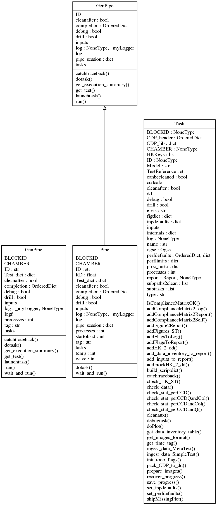
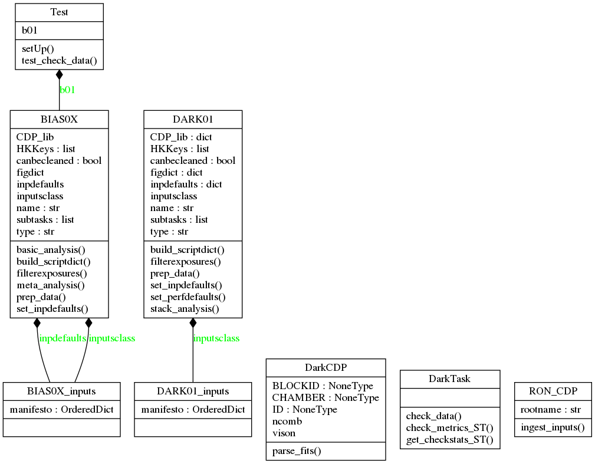

.. _guide:

Code Guide
==========

Here we provide a succint description of the code, what it does and how it is organised, to help the user / developer understand how things work, to better make use of it / repurpose it.

Capabilities of the Code
------------------------

First, it is convenient to know what the code here provided can do:

1. Write **excel scripts for the acquisition of data** using ELVIS. Each test has an associated class, and this class has a method which generates the description of the test that is then converted to excel. The test description can be modified at runtime by means of test object parameters. These test descriptions are a key element of the pipeline. Monitoring and analysis capabilities depend on them (i.e. knowing what *should* happen).
2. **Monitor the data acquisition** of the calibration campaign in real time. This is done through the sub-package "eyegore". It can monitor the data flow, values in the HK data stream (cheking value against limits), display images and the exposure log, and issue warnings via sms and e-mail.
3. **Analyse the data** from the tests. This is the core functionality of the pipeline.
4. Produce calibration / analysis results in a range of formats: **Json, FITS, excel**, etc.
5. Produce **test reports** for each test in pdf (via LaTeX).
6. Collate and produce summary reports from a set of tests across all calibrated blocks (**metatests**).
7. Analyse data from the whole VIS FPA (**fpatests**).
8. **Simulate data** (very basic capabilities).

Code Architecture
-----------------

First, it is convenient to introduce some nomenclature regarding the executiong of the pipeline that you may see used in the naming of classes and functions therein:

* A **Task** is basically a test (e.g. BIAS02), with a description of how the test data should be acquired, methods to analyse the data once acquired, and others to plot, produce reports, check compliances, etc. 
* The execution of a Task is broken down into **subtasks**, which are methods of the the Task classes.
* A **pipeline** is a sequential execution of a number of a tasks. In the pipeline it takes shape as a class (**Pipe**) that has to be instantiated with inputs to perform analysis on a number of tests, using the data stored somewhere.

A diagram with the classes for the parent classes Task and Pipe (which inherits from a generic pipeline class, GenPipe) is shown in the next figure.

All tests in the campaign have an associated class, which inherits from **Task**. For example, tests BIAS01 and BIAS02 are created as "instances" of the class BIAS0X, and test DARK01 from the class DARK01. Both inherit from a common class, DarkTask, which in turn inherits from Task.

Delving into the Task class
^^^^^^^^^^^^^^^^^^^^^^^^^^^

Because the **Task** class is central to the workings of the pipeline, as it is "what tests are made of", let's have a closer look at its methods and attributes.

First, the **Attributes**, in a lax order of relevance:

* **dd**: an instance of the class datamodels.core.DataDict (see :ref:`datamodel`/core.py). This is where almost all key data needed to perform analysis of the test is stored. Basically, it is a copy of the EXPLOG for the test, with HK added. Then, as the analysis of the Task progresses, more data from the analysis performed gets added to dd. dd is saved after each subtask in the task is executed, and reloaded before starting the next, to keep an updated hardcopy throught the analysis work, in case the task is interrupted unexpectedly, to be able to retake it from the last step.
* **report**: This is an instance of the class *support.report.Report*. It is populated with tables, statements and figures as the task execution progresses. The report has a *.doreport()* method that generates a LaTeX version of itself, and compiles it to a .pdf file.
* **BLOCKID**: a character string with a label identifying the block (piece of hardware) being analysed / worked on. In the VGCC these were names of famous physicists. These BLOCKID labels are used in loading inputs specific to the block (for example, expected values of offsets for each quadrant), or labelling some outputs.
* **CHAMBER**: a character to distinguish the chamber where the analysis of the data is to be conducted (when writing scripts), or has been conducted (when analysing data). Used, for example, to load specific tables with exposure times, focus positions, and other OGSE-related parameters.
* HKKeys: a list with the list of HK parameters from HK files to be added to the **DataDict**.
* **CDP_lib**: This is dictionary with the pairs of keywords and CDP objects. The CDP contents are added as the task progresses, and dumped as they are generated, usually towards the end of the execution of the task (in the "meta analysis" method).
* **ccdcalc**: an empty CCD object, created just to access to have at hand attributes (e.g. CCD dimensions) and methods (e.g. coordinates transformations) at any point in the task execution.
* **figdict**: a dictionary with pairs of figure keywords and 2 element lists. 
* **inpdefaults**: dictionary with default values of task inputs.
* **inputs**: the dictionary with inputs that is used to execute the subtasks. Populated at runtime.
* **inputsclass**: this is a class that can validate input values on ingestion of inputs. It is used by *set_inpdefaults()* method to set the *.inpdefaults* attribute.
* **log**: an instance of the class support.logger._myLogger. This is used to create a log that is "loaned" by the pipeline to the tasks while they are executing so that there is a common .txt log file to cover the whole execution of the pipeline.
* name:
* **ogse**: an instance of the class *ogse.ogse.Ogse*. This object is used to load and access information regarding the ogse, such as exposure times, for example.
* **perfdefaults**: dictionary with (default) performance limits.
* **perflimits**: dictionary with performance limits.
* **subtasks**: This is a list with the subtasks that are part of the task. Each entry has a keyword/name, and a method of the task class.

And regarding methods, these are the most important (common ones):

* **build_scriptdict()**: builds the a dictionary with the structure of the data acquisition of the test. This is, assigns values to each of the keywords in the *excel script* used to acquire the data, and for each column (exposure) in the script, according to the internal structure of the test inherent to the class (usually with some free parameters accessible to input parameters). 
* **set_inpdefaults()**: [defined at child classes, i.e. specific test classes] executed at instantiation (__init__()), this method populates *self.inpdefaults*, a dictioary with default inputs. These defaults are either too common, or they are just required to be able to instantiate the class, even if it's just to access some of its method, but not to do actual data analysis with it.
* **set_perfdefaults()**: this method sets values to the dictionary of default performance limits, *self.perdefaults*. These limits may be updated / overriden at run time by adding a dictionary named 'perflimits' to the pipeline inputs (*inputdict* in the input configuration script).
* **filterexposures()**: This method sub-selects the exposures in the (ELVIS generated) EXPLOG that correspond to the test, taking into account the values in the *Test* column, and usually a user-specified range of OBSIDs to consider. It also validates the acquisition parameters (collected in the EXPLOG) against the expected structure of the test.
* **check_data()**: This abstract method performs validation of the HK and the image values (e.g. RON, offsets, fluences) against expected values, according to the test design. The polymorphism of this method, which has to catter to the structure of very different tests, is managed through the call to sub-methods which are test-specific (and thus subclass-specific).
* ***prepare_images()**: Prepares images for further analysis. For example, converting the FITS files to CCD objects which *carry* analysis methods, subtracting offsets, dividing by flat-fields, etc. Depending on the test/subclass, it will perform different corrections.
* **addFigures_ST()**: adds a number of figures to the test report object, *self.report*. It uses the methods self.doPlot() and self.addFigure2Report().
* **doPlot()**: instantiates a figure object, and makes it dump the figure (to *render*) to a hard copy (a .png file).
* **addFigure2Report()**: Takes the figure file from the figure object and adds it to *self.report*.
* **save_progress()**: Saves self.dd and self.report to hardcopy files to save progress.
* **recover_progress()**: Reloads dd and report from hardcopies generated by self.save_progress().

Then, other common methods of Task subclasses are:

* **basic_analysis()**: This is a generic method that performs the basic steps of analysis. For example, in the case of PTC analysis, this method may just extract means and variances from the pairs of images in the sequnce acquired.
* **meta_analysis()**: This is another generic method, that usually performs the important / final part of the analysis, building on the preparation of images and the *basic_analysis()* performed before. In the example of the PTC analysis, this method actually builds the PTC curves and extracts the gain and other parameters from its analysis.

Code Flow
---------

It is perhaps easier to describe what the pipeline does, and how it is organised, following what it does when we use to perform different tasks.

Data-set Analysis
^^^^^^^^^^^^^^^^^

Let's first try to analyse a data-set.

We will call the script **vison_run** which instantiates a Pipeline object, loads it with the tests that we are going to process, the inputs to the tasks for those tests, and then runs the pipeline object. Let's go step by step with an example.

::

    ~$ vison_run -y [vison_config.py] -R [SESSION] -l -t [TAG]

Here vison_config.py stands for a python script with inputs (more on that soon), SESSION is a name to select the acquisition session within the the configuration file we want to select for analysis (there usually are several sessions within a configuration script, as there are data acquisition sessions in a multi-day campaign), and TAG is just a character string to label the directory with results, and the text log file, for ease of identification.

Before we go on, some basic notions regarding the organisation of the GCC:

* the campaign was sub-divided in campaigns for each block.
* within each block-campaign there were sessions/runs (-R comes from "run") in which several tests are executed one after another, autonomously by ELVIS.

For each block-campaign we created a vison_config script, with the name of the block in question and the date of the campaign (e.g. vison_config_EINSTEIN_JUL19.py). This script is important because it is required to run the pipeline, and because it serves as registry of the inputs used to run it.

Let's have a look at the contents of a vison_config.py script, in simplified form.

.. literalinclude:: vison_config_example.py
   :language: python

When vison_run is executed, this literally *executes* the vison_config script which generates a dictionary called **inputdict**. This dictionary has all the information necessary for the pipeline to run:

* in which facility (*chamber*) was the data acquired (relevant to know exposure times, for example).
* what tasks (tests) are to be executed/analysed.
* what values to assign to the free parameters of the tasks.
* what hardware are we testing.
* where to find the input data, and where to put the output results.
* where to find input calibration data products (e.g. cosmetics masks).

When vison_config.py is executed, it starts from:

::

    if __name__ == '__main__'

From there, it calls the function *get_config_dict* to create a standard version of the inputs dictionary, setting up the tasks and their standard inputs. Then it calls *add_RUN_specifics* to add data locations, OBSID ranges, and apply a selector of sub-tasks to execute for each task.

Going back to *vison_run*, once the inputs in the configuration file are ingested, the next important thing is to create an instance of the pipeline class:

::

    pipe = Pipe(inputdict, dolog=dolog, drill=drill,
                    debug=debug, startobsid=startobsid,
                    processes=multithread, tag=tag,
                    cleanafter=cleanafter)

This takes as input the input dictionary (inputdict) and other keywords to control the execution of the pipeline.

Then, the pipeline is executed, either in wait-for-data mode (in parallel with acquisition), or directly (assuming all data has already been acquired previously):

::

    if wait:
        pipe.wait_and_run(dayfolder, elvis=elvis)
    else:
        pipe.run()

In the **run** method, the pipe object cyles over the list of tasks to be executed, and launches each task with its specific inputs:

::
    for taskname in tasknames:

        taskinputs = self.inputs[taskname]
        taskinputs['resultspath'] = os.path.join(
        resultsroot, taskinputs['resultspath'])

        if explogf is not None:
            taskinputs['explogf'] = explogf
        if elvis is not None:
            taskinputs['elvis'] = elvis

        self.inputs[taskname] = taskinputs

        self.launchtask(taskname)

        [...]
    

The **launchtask** method is also a method of Pipe. Here, some further inputs parsing, and task execution logging are handled. But the actual instantiation of the Task object happens in the **dotask** method within **launchtask**.

::
    
    [...]
    taskreport = self.dotask(taskname, taskinputs,
                    drill=self.drill, debug=self.debug,
                    cleanafter=self.cleanafter)
    [...]

In **Pipe.dotask(...)** is where the Task object gets instantiated and executed:

::

    [...]

    test = self.get_test(strip_taskname, inputs=inputs, log=self.log,
            drill=drill, debug=debug, cleanafter=cleanafter)

    [...]

    Errors = test()

    [...]

The rest in that method is handling exceptions, and logging errors and test analysis execution durations.

Each Task has a **__call__()** method that is what is called when we do Errors = test(), and obviously returns any errors raised during the execution of the task.

The **__call__()** method is common to all Task subclasses, because it is inherited from Task class itself. The polymorphism of the tasks in their execution (e.g. different subtask methods), is handled through subclass methods, which are called via internal dictionaries that link methods to subtask names.

Data Models
-----------

See :ref:`datamodel`

Reusing / adapting the code
---------------------------

.. toctree::
    :maxdepth: 4
    
    reuse